# 坤典开源农业物联网平台

## 项目介绍
开源农业物联网系统，简单易用的农业物联网系统，广泛用于：农业物联网、智慧农业、智慧种植、智慧养殖、高标准农田、农产品溯源、数据大屏等场景，方便各中小企业使用，支持DTU、继电器、RS485传感器、视频监控GBT28181接入，低成本打造企业自己的农业物联网平台，支基于webman框架突破了传统PHP的性能瓶颈，高稳定性，超高性能，高复用，高扩展性，超级简单易用。
本系统是基于webman高性能框架开发的一套PHP开源物联网平台，可以实现物联网设备的DTU设备联网上线、数据采集、命令下发、被动回复、实时通讯等功能，支持TCP协议和Websocket协议（ws和wss），轻松搭建一套物联网系统。

系统提供TCP协议透传服务，用户需根据实际情况将设备协议转为TCP协议后接入系统，可使用DTU设备，如土壤传感器、气象设备、温湿度传感器、仪表、传感器、地磅、IO设备、开关量、模拟量、扫码枪、语音播报、身份证读卡器、各类灯具、门禁开关等设备都支持接入，实现设备轻松上云。

## 演示地址
- 演示后台：https://iot-test.cqkd.com
- 演示账户：联系技术获取（微信tukun0206）
- 小程序：搜索“坤典物联”


## 功能特性
1. **设备管理**：支持利用TCP协议从设备实时采集数据，支持modbusRTU协议，绑定传感器模板即可采集
2. **网关管理**：支持服务端秒级给设备下发指令，支持以队列的方式下发
3. **被动回复**：根据设备发送的特定指令，针对性的回复命令
4. **实时通讯**：可以跟设备实时进行通讯，方便验证命令和调试设备
5. **数据转发**：可以实现两个或多个设备之间的相互转发，如：想让设备采集的数据直接发送到网页websocket，用转发即可简单实现

## 环境要求
- PHP >= 8.1
- MySQL >= 5.7
- Redis >= 4.0


## 安装步骤

### 1. 下载代码
已宝塔为例：创建站点，克隆或下载本项目代码到服务器上，设置根目录为public。并放行端口6262
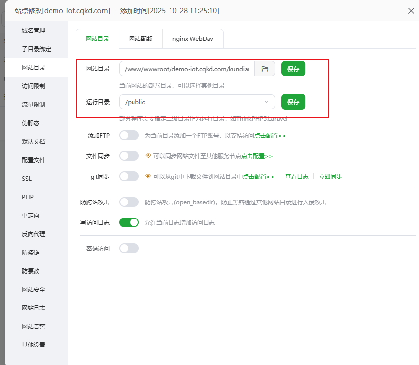
### 2. 配置伪静态
```
location /admin/ {
  proxy_pass http://127.0.0.1:6767;
  proxy_set_header Host $host;
  proxy_set_header X-Real-IP $remote_addr;
  proxy_set_header X-Forwarded-For $proxy_add_x_forwarded_for;
  proxy_set_header X-Forwarded-Proto $scheme;
}

location /ws {
    proxy_pass http://127.0.0.7:6161;
    proxy_http_version 1.1;
    proxy_set_header Upgrade $http_upgrade;
    proxy_set_header Connection "upgrade";
    proxy_set_header Host $host;
    proxy_set_header X-Real-IP $remote_addr;
    proxy_set_header X-Forwarded-For $proxy_add_x_forwarded_for;
    proxy_set_header X-Forwarded-Proto $scheme;
    proxy_read_timeout 86400s;
    proxy_send_timeout 86400s;
    proxy_connect_timeout 4s;
}

location /wss {
    proxy_pass https://127.0.0.1:6363;
    proxy_http_version 1.1;
    proxy_set_header Upgrade $http_upgrade;
    proxy_set_header Connection "upgrade";
    proxy_set_header Host $host;
    proxy_set_header X-Real-IP $remote_addr;
    proxy_set_header X-Forwarded-For $proxy_add_x_forwarded_for;
    proxy_set_header X-Forwarded-Proto $scheme;
    proxy_read_timeout 86400s;
    proxy_send_timeout 86400s;
}

location / {
    try_files $uri $uri/ /index.html;
}
```
### 3. 配置环境变量
在项目根目录创建`.env`文件，复制`.env.example`文件的内容并根据实际环境修改配置：
```bash
cp .env.example .env
```
编辑`.env`文件，修改以下关键配置项（数据库可以通过后面引导页配置，redis必须配置）：
```
# Redis配置
REDIS_HOST = 127.0.0.1
REDIS_PORT = 6379
REDIS_PWD = 
REDIS_SELECT = 1

# 数据库配置
TYPE = mysql
HOSTNAME = 127.0.0.1
DATABASE = iot
USERNAME = root
PASSWORD = 123456
HOSTPORT = 3306
CHARSET = utf8
PREFIX = kd_

# 证书配置（用于WSS协议）
ssl_cert = 
ssl_key = 
```
### 5. 安装redis，去掉禁用函数
```bash
pcntl_signal_dispatch,pcntl_signal,pcntl_alarm,pcntl_fork,pcntl_wait,proc_open,shell_exec,exec,putenv
```
### 6. 启动项目
在项目根目录执行以下命令启动系统：
```bash
php start.php start
```
如需在后台运行，可以使用宝塔面板的进程守护管理器，添加为一个守护进程：

```bash
php start.php start 
```
### 7. 安装引导
```
申请ssl证书，访问安装页面域名+/admin/install 完成之前所有步骤后会显示出以下页面
```
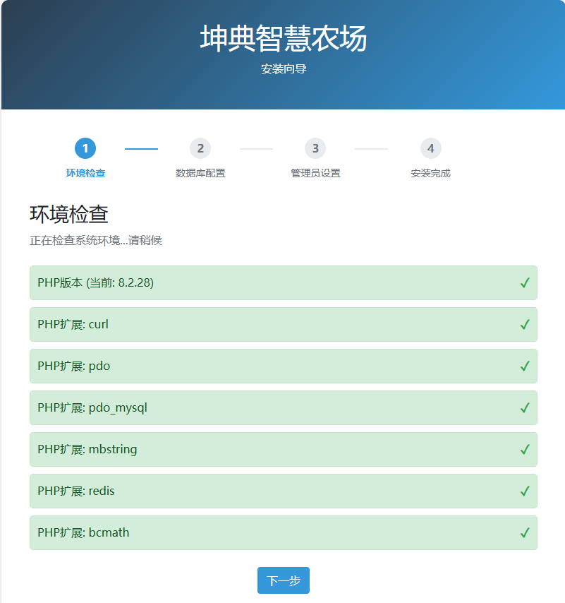

## 端口配置
系统使用的主要端口包括：
- webman的HTTP协议监听端口
- TCP协议监听端口 6262
- WebSocket协议监听端口(ws)6363
- WebSocket协议监听端口(wss)

请确保这些端口在服务器安全组和防火墙中已开放。

## 更多文档
具体二次开发需要使用的细节可参考webman框架的完整手册：https://www.workerman.net/doc/webman

## 技术支持
如遇问题，请联系技术支持（微信tukun0206）


## 使用说明

## 一、后台登录
登录后台
 默认安装账户admin   密码：数据库中查看
### 网关管理
添加网关设备,也就是添加DTU设备，需要有一台DTU设备，推荐有人DTU，稳定简单易用
1、名称：必填，设备名称。
2、MAC / IMEI：
必填。自定义注册包是设备与服务端建立连接的唯一凭证，设备在连接服务端时，必须使用自定义注册包，否则服务端会拒绝连接。
自定义注册包可以是任意字符串，但是不能包含英文逗号，否则会导致解析错误。
注册包是设备的唯一ID且不能跟其他设备重复，相当于设备的身份证，用于向服务端验证身份。一般是在使用DTU的时候配置在DTU里，第一次连接服务端的时候，DTU会发送自定义注册包进行身份注册。服务端验证通过后建立连接。
自定义注册包只需在第一次连接服务端时发送，后续连接服务端时，不需要再发送。

3、通讯协议：默认TCP透传

4.网络类型：这里根据设备实际选择即可；

5.手动设置定位即可。

## 设备管理
添加设备名称，选择关联网关与设备模板即可
## 页面截图
管理后端页面截图，客户端支持微信小程序，搜索演示“坤典物联网”，客户端采用uniapp跨平台开发，支持打包安卓、IOS、H5等平台
### 登录页面
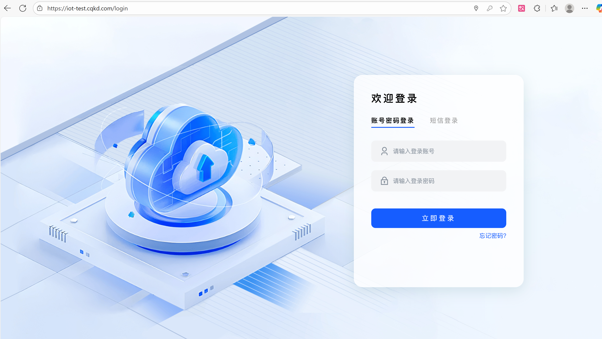
### 登录首页
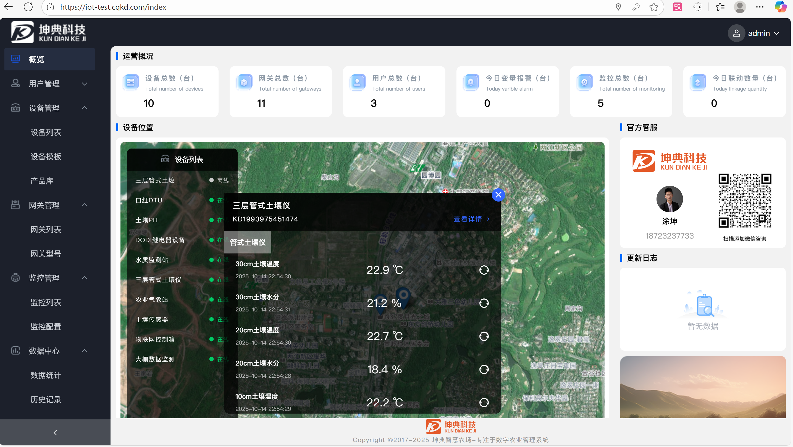
### 用户列表
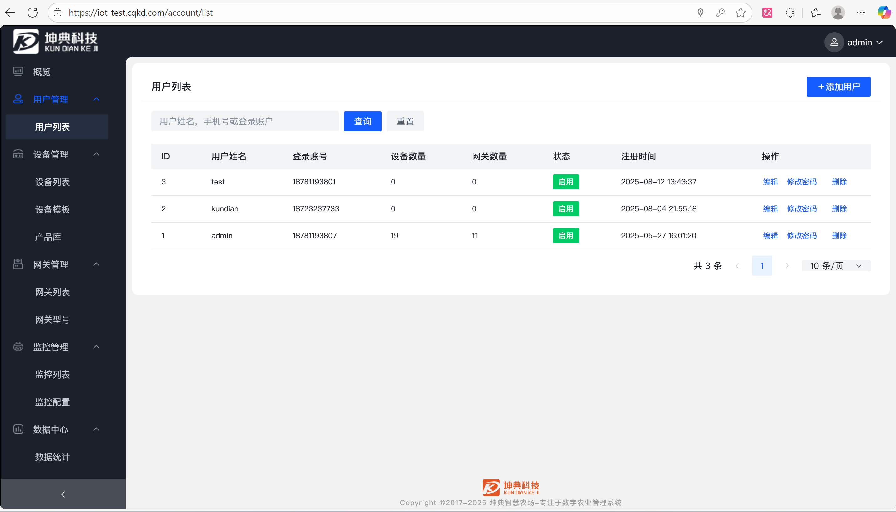
### 设备列表
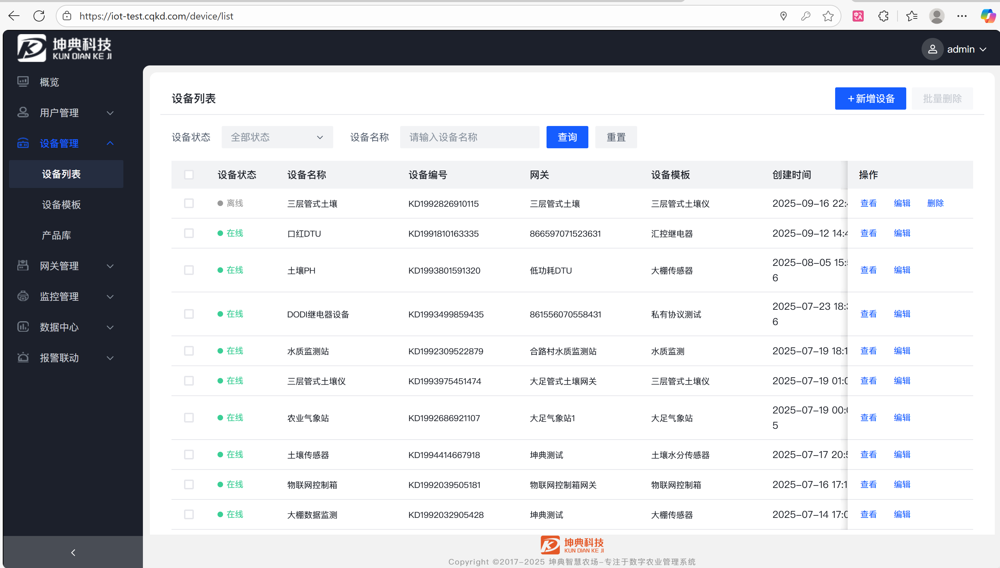
### 设备数据
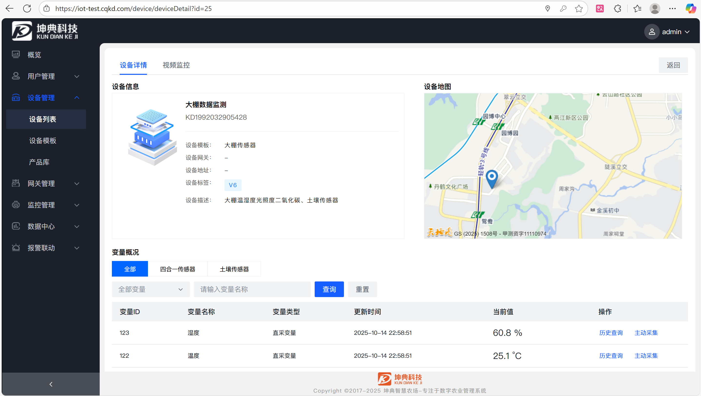
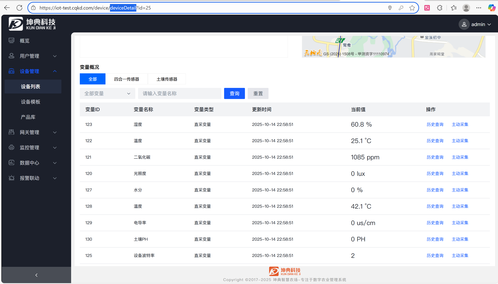
### 设备控制
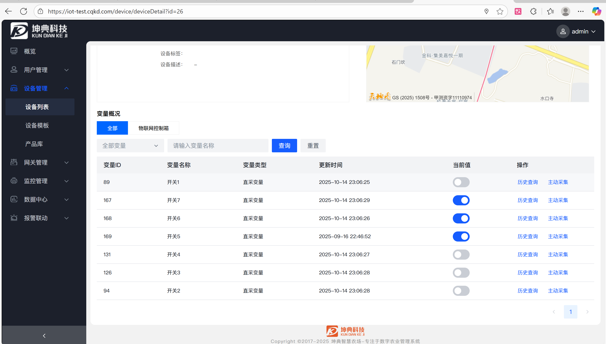
### 设备关联视频监控
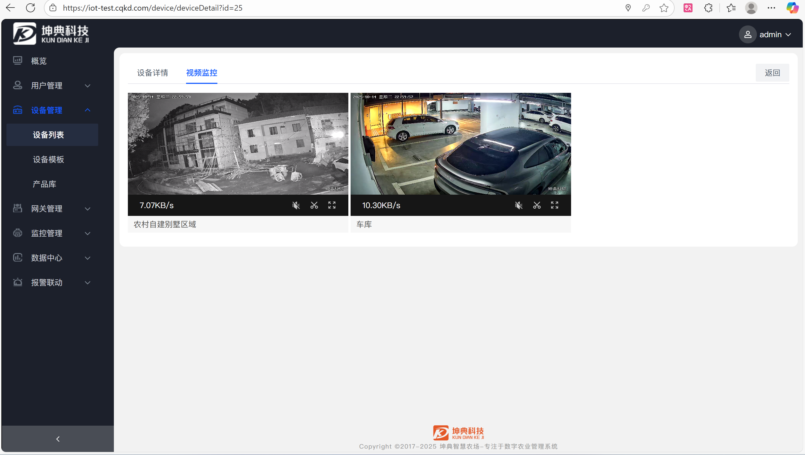
### 设备模板
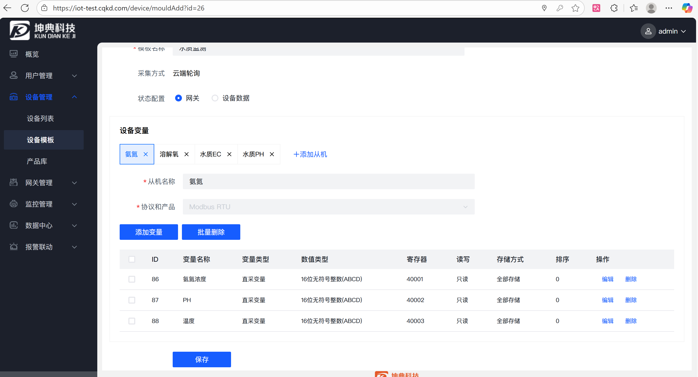
### 产品库

### 网关管理
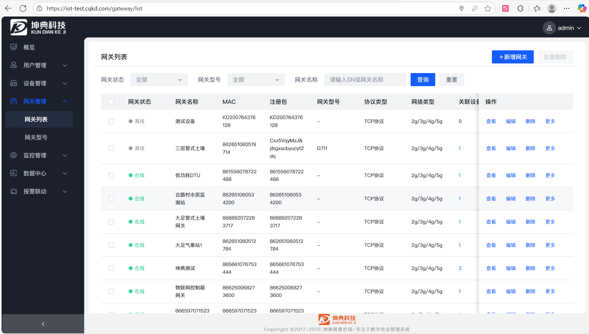
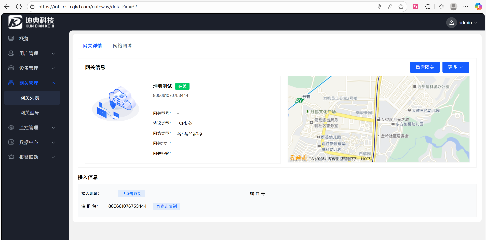
### 监控管理
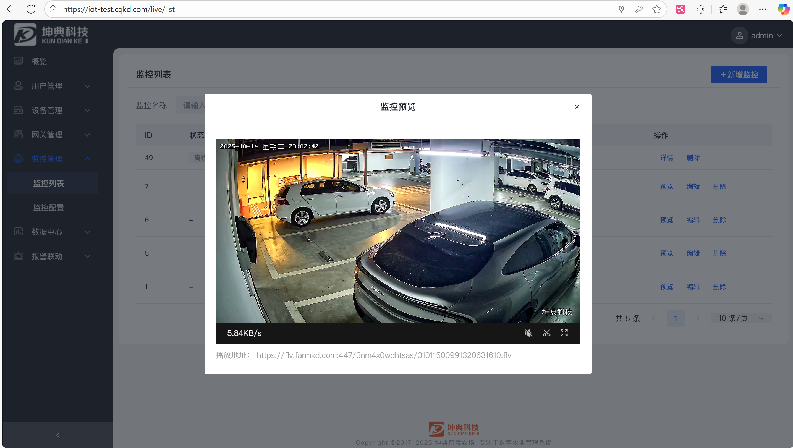
### 国标监控

### 历史数据
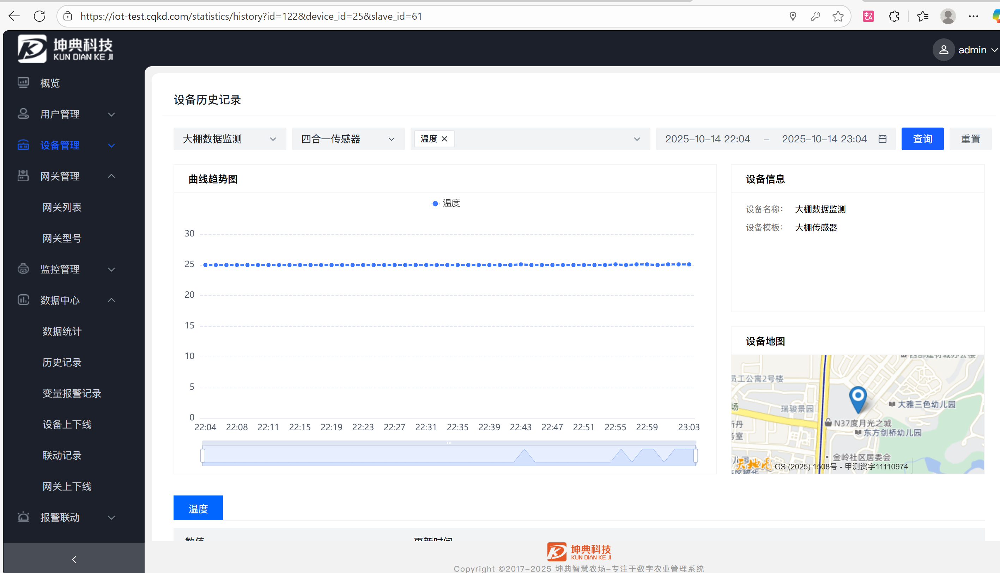
### 报警联动
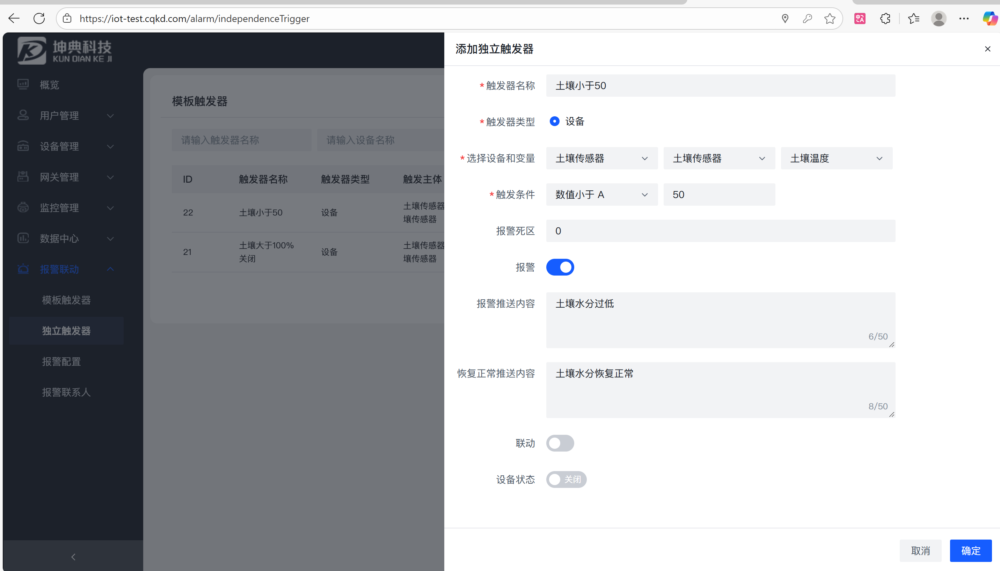